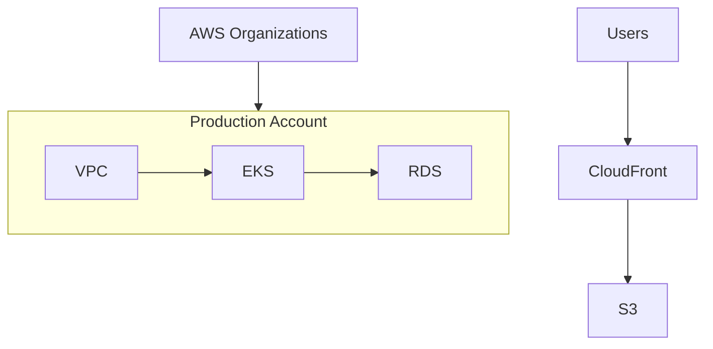

# AWS Diagram Examples

## Minimal web app

```python
from diagrams import Diagram, Edge
from diagrams.aws.compute import EC2
from diagrams.aws.database import RDS
from diagrams.aws.network import ELB

with Diagram("Simple Web App", show=False, direction="TB"):
    lb = ELB("Load Balancer")
    web = [EC2("Web 1"), EC2("Web 2"), EC2("Web 3")]
    db = RDS("PostgreSQL")
    lb >> Edge(label="HTTPS") >> web >> db
```

## Multi-account production (simplified)

Based on the [Diatom Labs Innovate Inc. tutorial](https://blog.diatomlabs.com/creating-aws-architecture-diagrams-with-python-and-cursor-a-step-by-step-guide-c88a0aa16298).

```python
from diagrams import Diagram, Cluster, Edge, Node
from diagrams.aws.compute import EKS, ECR
from diagrams.aws.database import RDS
from diagrams.aws.management import Organizations, Cloudtrail, Cloudwatch
from diagrams.aws.network import ALB, NATGateway, ClientVpn, CloudFront, VPC, InternetGateway, Endpoint
from diagrams.aws.security import Guardduty, SecretsManager, IdentityAndAccessManagementIam
from diagrams.aws.storage import S3
from diagrams.aws.general import Users
from diagrams.onprem.ci import GithubActions
from diagrams.onprem.gitops import ArgoCD
from diagrams.onprem.vcs import Github

COLOR_PROD = "#F44336"
COLOR_NETWORK = "#8BC34A"
COLOR_CICD = "#795548"

with Diagram("Production Architecture", show=False, direction="TB", outformat=["png"]):
    users = Users("End Users")
    admin = Users("Admin")

    with Cluster("GitHub", graph_attr={"bgcolor": COLOR_CICD + "20"}):
        github = Github("Source")
        ci = GithubActions("CI/CD")
        github >> ci

    with Cluster("Management"):
        orgs = Organizations("AWS Organizations")
        iam = IdentityAndAccessManagementIam("IAM Identity Center")

    with Cluster("Production Account", graph_attr={"bgcolor": COLOR_PROD + "10"}):
        account = Node("Account")
        ecr = ECR("ECR")
        vpn = ClientVpn("VPN")

        with Cluster("Static Frontend"):
            cf = CloudFront("CloudFront")
            s3 = S3("React SPA")
            cf >> s3
            users >> Edge(label="Web") >> cf

        with Cluster("VPC", graph_attr={"bgcolor": COLOR_NETWORK + "20"}):
            with Cluster("Public Subnets"):
                alb = ALB("ALB")
                nat = NATGateway("NAT")
            with Cluster("Private Subnets"):
                eks = EKS("EKS")
                argo = ArgoCD("ArgoCD")
                rds = RDS("PostgreSQL")

    orgs >> Edge(label="Manage") >> account
    ci >> Edge(label="Push Images") >> ecr
    github >> argo
    ecr >> Edge(label="Pull") >> eks
    users >> Edge(label="API") >> alb
    alb >> eks >> rds
    admin >> Edge(label="VPN") >> vpn >> eks
    admin >> Edge(label="SSO") >> iam >> account
```

## Mermaid fallback (account relationships)

For quick sketches without AWS icons:



## Iteration prompt template

Use this when generating from requirements in Cursor:

```
Based on the architecture requirements, write a Python script using the
diagrams library (https://diagrams.mingrammer.com/). Requirements:
- show=False, direction=TB, outformat png
- nested Cluster per AWS account and VPC
- color-coded clusters per environment
- labeled Edge for all cross-boundary connections
- assign shared nodes to variables; do not connect to Cluster objects
Start with imports and skeleton, then add one account at a time.
```
