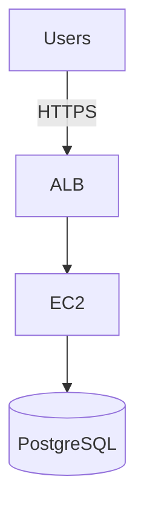
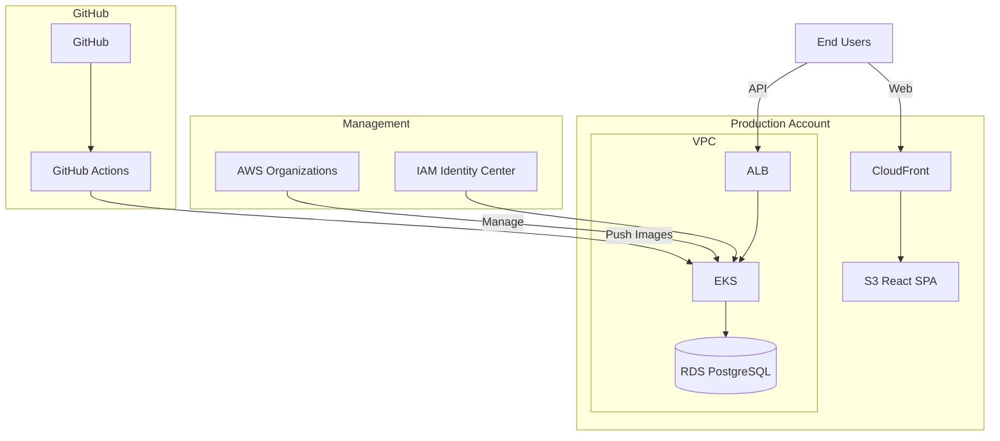
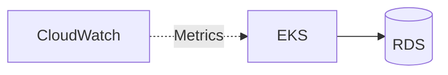

# Mermaid → AWS Diagram Examples

## Example 1: Simple web stack

### Mermaid input



### Generated Python

```python
from diagrams import Diagram, Edge
from diagrams.aws.compute import EC2
from diagrams.aws.database import RDS
from diagrams.aws.general import Users
from diagrams.aws.network import ALB

with Diagram("Simple Web Stack", show=False, direction="TB", filename="web-stack"):
    users = Users("Users")
    lb = ALB("ALB")
    web = EC2("EC2")
    db = RDS("PostgreSQL")

    users >> Edge(label="HTTPS") >> lb >> web >> db
```

## Example 2: Multi-account with subgraphs

### Mermaid input



### Generated Python (abbreviated)

```python
from diagrams import Diagram, Cluster, Edge, Node
from diagrams.aws.compute import EKS
from diagrams.aws.database import RDS
from diagrams.aws.general import Users
from diagrams.aws.management import Organizations
from diagrams.aws.network import ALB, CloudFront
from diagrams.aws.security import IdentityAndAccessManagementIam
from diagrams.aws.storage import S3
from diagrams.onprem.ci import GithubActions
from diagrams.onprem.vcs import Github

COLOR_PROD = "#F44336"
COLOR_NETWORK = "#8BC34A"
COLOR_CICD = "#795548"

with Diagram("Production Architecture", show=False, direction="TB", filename="production"):
    users = Users("End Users")

    with Cluster("Management"):
        org = Organizations("AWS Organizations")
        iam = IdentityAndAccessManagementIam("IAM Identity Center")

    with Cluster("Production Account", graph_attr={"bgcolor": COLOR_PROD + "10"}):
        account = Node("Account")
        with Cluster("VPC", graph_attr={"bgcolor": COLOR_NETWORK + "20"}):
            alb = ALB("ALB")
            eks = EKS("EKS")
            rds = RDS("RDS PostgreSQL")
        cf = CloudFront("CloudFront")
        s3 = S3("S3 React SPA")
        cf >> s3

    with Cluster("GitHub", graph_attr={"bgcolor": COLOR_CICD + "20"}):
        repo = Github("GitHub")
        gha = GithubActions("GitHub Actions")
        repo >> gha

    users >> Edge(label="Web") >> cf
    users >> Edge(label="API") >> alb
    org >> Edge(label="Manage") >> account
    gha >> Edge(label="Push Images") >> eks
    alb >> eks >> rds
    iam >> eks
```

## Example 3: Dashed monitoring edge

### Mermaid input



### Generated Python

```python
from diagrams import Diagram, Edge
from diagrams.aws.compute import EKS
from diagrams.aws.database import RDS
from diagrams.aws.management import Cloudwatch

with Diagram("EKS with Monitoring", show=False, direction="LR", filename="eks-monitor"):
    eks = EKS("EKS")
    rds = RDS("RDS")
    cw = Cloudwatch("CloudWatch")

    eks >> rds
    cw >> Edge(label="Metrics", style="dashed") >> eks
```

## Conversion prompt template

Use when the user attaches a Mermaid chart:

```
Convert the attached Mermaid flowchart to a Python script using the
diagrams library (https://diagrams.mingrammer.com/). Requirements:
- Preserve subgraph nesting as Cluster blocks
- Map node labels to AWS icons via keyword matching
- Preserve all edge labels; dashed edges use style="dashed"
- show=False, outformat png, filename matching the diagram title
- Fall back to Node("Label") when no icon matches
- Add a comment linking to the source Mermaid
Run the script and report the output PNG path.
```

## Iteration loop

When the rendered diagram differs from intent:

1. User edits Mermaid (structure) **or** Python (icons/layout)
2. Re-run conversion if Mermaid changed; otherwise edit Python directly
3. Prefer fixing icon mapping in Python for one-off tweaks

Keep `.mmd` and `.py` in sync when both exist — Mermaid is the structural source of truth.
