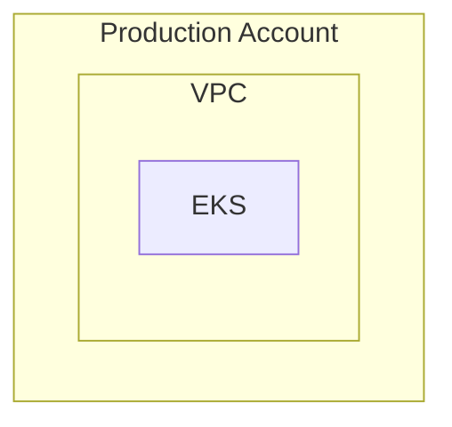

# Mermaid → diagrams Mapping Reference

## Mermaid syntax quick reference

### Node shapes

| Mermaid | Meaning | diagrams hint |
|---------|---------|---------------|
| `id[Label]` | Rectangle | Default service node |
| `id(Label)` | Rounded | App / generic compute |
| `id[(Label)]` | Cylinder | Database (`RDS`, `Dynamodb`) |
| `id((Label))` | Circle | Event / trigger |
| `id{Label}` | Diamond | Decision — use `Node("Label")` |
| `id>Label]` | Flag | Queue / stream |
| `id[[Label]]` | Subroutine | Nested process — `Lambda`, `StepFunctions` |

### Edge syntax

| Mermaid | Python |
|---------|--------|
| `A --> B` | `a >> b` |
| `A --> B --> C` | `a >> b >> c` |
| `A -->|HTTPS| B` | `a >> Edge(label="HTTPS") >> b` |
| `A -.-> B` | `a >> Edge(style="dashed") >> b` |
| `A ==> B` | `a >> Edge(style="bold") >> b` |
| `A -- text --> B` | `a >> Edge(label="text") >> b` |
| `A --- B` | `a - b` |

### Subgraphs



```python
with Cluster("Production Account"):
    with Cluster("VPC"):
        eks = EKS("EKS")
```

Mermaid `subgraph id["Title"]` — use **Title** as the cluster label; `id` is not rendered.

### Direction

| Mermaid | `Diagram(...)` |
|---------|----------------|
| `flowchart TB` / `TD` | `direction="TB"` |
| `flowchart BT` | `direction="BT"` |
| `flowchart LR` | `direction="LR"` |
| `flowchart RL` | `direction="RL"` |

## AWS icon keyword table

Match label text (case-insensitive). First match wins within category.

### Compute

| Keywords in label | Import | Class |
|-------------------|--------|-------|
| eks, kubernetes | `diagrams.aws.compute` | `EKS` |
| ecs, fargate | `diagrams.aws.compute` | `ECS` / `Fargate` |
| ec2, instance | `diagrams.aws.compute` | `EC2` |
| lambda | `diagrams.aws.compute` | `Lambda` |
| ecr, container registry | `diagrams.aws.compute` | `ECR` |
| batch | `diagrams.aws.compute` | `Batch` |

### Database

| Keywords | Import | Class |
|----------|--------|-------|
| rds, postgres, postgresql, mysql, aurora | `diagrams.aws.database` | `RDS` / `Aurora` |
| dynamodb, dynamo | `diagrams.aws.database` | `Dynamodb` |
| elasticache, redis, memcached | `diagrams.aws.database` | `ElastiCache` |

Cylinder shape `[(...)]` boosts database category even without keywords.

### Network

| Keywords | Import | Class |
|----------|--------|-------|
| alb, application load balancer | `diagrams.aws.network` | `ALB` |
| nlb, network load balancer | `diagrams.aws.network` | `NLB` |
| elb, load balancer, lb | `diagrams.aws.network` | `ELB` / `ALB` |
| cloudfront, cdn | `diagrams.aws.network` | `CloudFront` |
| route53, dns | `diagrams.aws.network` | `Route53` |
| api gateway, apigw | `diagrams.aws.network` | `APIGateway` |
| vpc | `diagrams.aws.network` | `VPC` |
| nat, nat gateway | `diagrams.aws.network` | `NATGateway` |
| igw, internet gateway | `diagrams.aws.network` | `InternetGateway` |
| vpn, client vpn | `diagrams.aws.network` | `ClientVpn` |
| endpoint, vpc endpoint | `diagrams.aws.network` | `Endpoint` |

### Storage

| Keywords | Import | Class |
|----------|--------|-------|
| s3, bucket | `diagrams.aws.storage` | `S3` |
| efs | `diagrams.aws.storage` | `EFS` |
| ebs | `diagrams.aws.storage` | `EBS` |
| glacier | `diagrams.aws.storage` | `Glacier` |

### Security

| Keywords | Import | Class |
|----------|--------|-------|
| iam, identity center | `diagrams.aws.security` | `IdentityAndAccessManagementIam` |
| waf | `diagrams.aws.security` | `WAF` |
| secrets manager, secrets | `diagrams.aws.security` | `SecretsManager` |
| kms | `diagrams.aws.security` | `KMS` |
| guardduty | `diagrams.aws.security` | `Guardduty` |
| shield | `diagrams.aws.security` | `Shield` |

### Integration

| Keywords | Import | Class |
|----------|--------|-------|
| sqs, queue | `diagrams.aws.integration` | `SQS` |
| sns, notification | `diagrams.aws.integration` | `SNS` |
| eventbridge, event bus | `diagrams.aws.integration` | `Eventbridge` |
| step functions, sfn | `diagrams.aws.integration` | `StepFunctions` |

### Management

| Keywords | Import | Class |
|----------|--------|-------|
| organizations, org | `diagrams.aws.management` | `Organizations` |
| cloudwatch, monitoring | `diagrams.aws.management` | `Cloudwatch` |
| cloudtrail, audit | `diagrams.aws.management` | `Cloudtrail` |
| config | `diagrams.aws.management` | `Config` |
| ssm, systems manager | `diagrams.aws.management` | `SystemsManager` |

### DevTools

| Keywords | Import | Class |
|----------|--------|-------|
| codebuild | `diagrams.aws.devtools` | `Codebuild` |
| codepipeline, pipeline | `diagrams.aws.devtools` | `Codepipeline` |
| codecommit | `diagrams.aws.devtools` | `Codecommit` |

### General / users

| Keywords | Import | Class |
|----------|--------|-------|
| user, users, end user, admin | `diagrams.aws.general` | `Users` |
| client | `diagrams.aws.general` | `Client` |
| internet | `diagrams.aws.general` | `InternetAlt1` |

### On-prem / external

| Keywords | Import | Class |
|----------|--------|-------|
| github | `diagrams.onprem.vcs` | `Github` |
| gitlab | `diagrams.onprem.vcs` | `Gitlab` |
| github actions, gha | `diagrams.onprem.ci` | `GithubActions` |
| jenkins | `diagrams.onprem.ci` | `Jenkins` |
| argocd, argo cd | `diagrams.onprem.gitops` | `ArgoCD` |
| flux | `diagrams.onprem.gitops` | `Flux` |
| datadog | `diagrams.onprem.monitoring` | `Datadog` |
| prometheus | `diagrams.onprem.monitoring` | `Prometheus` |
| grafana | `diagrams.onprem.monitoring` | `Grafana` |

**Common fix:** `ArgoCD` is in `diagrams.onprem.gitops`, not `diagrams.onprem.ci`.

### Fallback

```python
from diagrams import Node
fallback = Node("Label from Mermaid")
```

Use for: decision nodes, unknown services, generic boxes (`API`, `Service`).

## Subgraph → cluster color hints

When subgraph titles contain environment keywords:

| Title keyword | Suggested constant |
|---------------|-------------------|
| production, prod | `COLOR_PROD = "#F44336"` |
| staging, stage | `COLOR_STAGING = "#FFC107"` |
| development, dev | `COLOR_DEV = "#03A9F4"` |
| management, shared | `COLOR_MANAGEMENT = "#009688"` |
| vpc, network | `COLOR_NETWORK = "#8BC34A"` |
| cicd, github, pipeline | `COLOR_CICD = "#795548"` |

Apply: `graph_attr={"bgcolor": COLOR_PROD + "10"}`.

## Parsing pitfalls

| Pitfall | Handling |
|---------|----------|
| Same label, different IDs | Separate variables; same icon class OK |
| `&` multi-target (`A --> B & C`) | Expand to `A --> B` and `A --> C` |
| HTML in labels (`<br/>`) | Replace with `\n` in icon label string |
| Special chars in IDs | Sanitize to valid Python identifiers |
| Implicit nodes (edge before define) | Declare all nodes before edges |

## Discovering icons

```bash
python3 -c "from diagrams.aws import compute; print(dir(compute))"
```

Browse: https://diagrams.mingrammer.com/docs/nodes/aws
